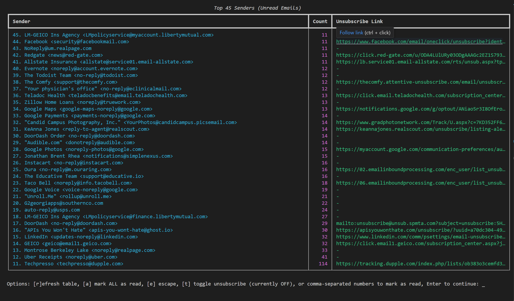

# Zenbox Email Analyzer

>This script fetches your recent unread emails from Gmail and displays a ranked list of senders by the number of emails received, including unsubscribe links if available. You can batch mark emails as read, open unsubscribe links, automatically send unsubscribe emails with emailto: links (if you do 100 and 50 are emails and 50 are websites, it will send and open 50 each. If you want to do this, plan to let your browser get spammed with open unsubscribe windows), and more!



(Optionally) You can use [Coins CLI / jgl (jingle)](https://github.com/kjr247/CoinsCLI) for audible feedback when you run long running scripts.


---

## Setup Instructions

### 1. Install Python 3.7+
- Download and install from [python.org](https://www.python.org/downloads/)

### 2. Install Required Python Packages
Open a terminal in this directory and run:
```python
pip install --upgrade google-api-python-client google-auth-httplib2 google-auth-oauthlib rich python-dotenv
```

### 3. Set Up Google Cloud Project and OAuth Credentials
1. Go to the [Google Cloud Console](https://console.cloud.google.com/apis/credentials)
2. Create a new project (or select an existing one)
3. Click "+ CREATE CREDENTIALS" and choose **OAuth client ID**
4. If prompted, configure the consent screen (fill in required fields)
5. For "Application type", select **Desktop app**
6. Name it (e.g., "Zenbox Email Analyzer")
7. Click **Create**
8. Click **Download JSON** on the credentials you just created
9. Save the file as `ZenboxDesktop.client_secret_...json` (or update the script to use your filename) in this directory
10. Enable the Gmail API for your project:
    - Go to **APIs & Services** > **Library**
    - Search for **Gmail API** and click **Enable**

### 4. (Optional) Configure SMTP for Unsubscribe (mailto: links)
To enable automatic unsubscribe for `mailto:` links, set up a Gmail App Password and add it to a `.env` file:
```env
SMTP_USER=your_email@gmail.com
SMTP_PASS=your_app_password
```
**How to create a Gmail App Password:**
1. Go to https://myaccount.google.com/security
2. Enable 2-Step Verification if you haven't already.
3. Under "Signing in to Google," select **App Passwords**.
4. Choose **Mail** as the app and **Other** (or your device) as the device, then click **Generate**.
5. Copy the generated 16-character password and use it as `SMTP_PASS` in your `.env` file.
> The script will use these credentials to send unsubscribe emails directly for mailto: links. If not set, you will be prompted at runtime. **Never commit `.env` to version control.**

### 5. Run the Script
In your terminal, run:
```bash
python zenbox.py
```
The first time, a browser window will open for you to log in and authorize access to your Gmail account.

---

## Interactive CLI Options

When running the Zenbox script, you can interact with the table using the following options:

| Key / Input         | Action                                                                 |
|---------------------|------------------------------------------------------------------------|
| `r`                 | Refresh the table                                                      |
| `a`                 | Mark ALL emails from all displayed senders as read (and unsubscribe)   |
| `e`                 | Exit the application                                                   |
| `t`                 | Toggle unsubscribe (ON/OFF) for mailto: and HTTP unsubscribe links     |
| Comma numbers (e.g. `1,3,5`) | Mark selected senders as read (and unsubscribe if enabled)      |
| `Enter` (empty)     | Continue without taking action                                         |

## Flags

| Flag                  | Type      | Default | Description                                                        |
|-----------------------|-----------|---------|--------------------------------------------------------------------|
| `--top-senders`       | Integer   | 25      | Number of top senders to display                                   |
| `--max-emails`        | Integer   | 1000   | Max unread emails to fetch and parse for top senders               |
| `--show-unsubscribe`  | Boolean   | False   | Show unsubscribe links for unread emails (no sender table)         |
| `--max-unsubscribe`   | Integer   | 100     | Max unread emails to check for unsubscribe links                   |

## Flag Options

| Option                | Description                                                                 |
|-----------------------|-----------------------------------------------------------------------------|
| `--top-senders N`     | Number of top senders to display in the table (default: 25)                 |
| `--max-emails N`      | Maximum number of unread emails to fetch and parse (default: 1000)          |
| `--show-unsubscribe`  | Display unsubscribe links for up to `--max-unsubscribe` unread emails only  |
| `--max-unsubscribe N` | Maximum unread emails to check for unsubscribe links (default: 100)         |

---

## Usage Examples

Show top 40 senders from up to 500 unread emails:
```bash
python zenbox.py --max-emails 500 --top-senders 40
```

Show unsubscribe links for up to 200 unread emails:
```bash
python zenbox.py --show-unsubscribe --max-unsubscribe 200
```

---

## Notes

- No secrets are hardcoded; credentials are loaded from your OAuth file and stored in `token.pickle` (which should not be checked into version control).
- The script only processes unread emails by default.
- The output table includes the sender, email count, and the first unsubscribe link found for each sender (if available).
